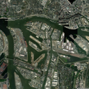

# CODA-DVD: Cascaded On-Board Attention for Dark Vessel Detection

> AI in Space Hackathon | Liquid Track | Alex Hiesch

On-board satellite AI pipeline using LFM2.5-VL. Filters 98%+ of downlink bandwidth by discarding clouds, empty ocean, and irrelevant data before transmission.

## Demo Video

https://github.com/user-attachments/assets/placeholder

44s walkthrough with voiceover: architecture overview, example detections, live pipeline run.

[Download MP4](media/final/01_CompositeDemo.mp4)

## Architecture


Interactive diagram: [coda_dvd_architecture.excalidraw](coda_dvd_architecture.excalidraw) (download and open at [excalidraw.com](https://excalidraw.com))

Three stages, each discarding data that doesn't matter:

| Stage | What it does | Bands used | Result |
|-------|-------------|------------|--------|
| 1. CloudFilter | SCL band cloud pixel count + metadata check | SCL | >70% cloud: discard (100% saved) |
| 2. AnomalyDetector | NIR thresholding + LFM2.5-VL confirmation | NIR, RGB | No vessel: discard (100% saved) |
| 3. SuperResolution | Mapbox 0.5m/px fetch + VLM classification | RGB (hi-res) | 128x128 crop + JSON: transmit (~15KB vs 820KB) |

## Example Outputs

**Stage 2: Sentinel-2 ROI detection (Hamburg, 10m)**

Red boxes: regions of interest from NIR pre-filter + VLM confirmation.

**Stage 3: Mapbox vessel detection (Hamburg, 0.5m)**

Green boxes: individual vessels classified by LFM2.5-VL (type, length, heading).

**Downlink crop (128x128, all that gets transmitted)**


**Singapore anchorage (bonus)**


## LFM2.5-VL Usage

The model makes three decisions in the pipeline:

1. **Anomaly confirmation** (Stage 2): filters CV false positives
2. **Vessel classification** (Stage 3): type, length, heading
3. **Grounding**: `[{"label": "ship", "bbox": [x1,y1,x2,y2]}]` (normalized 0-1)

Runtime on Apple M3 Max (simulating Jetson Orin 16GB):
- `mlx-community/LFM2.5-VL-1.6B-8bit`, 2.6 GB, ~220 tok/s

## Fine-Tuning

Fine-tuned LFM2.5-VL on [VRSBench](https://huggingface.co/datasets/xiang709/VRSBench) (NeurIPS 2024) for satellite vessel grounding.

- LoRA r=16, alpha=32, 2.4M trainable params
- 3 epochs on Modal H100, cosine LR 3e-5
- Config: `fine_tuning/vessel_grounding_modal.yaml`
- Trained on limited subset as proof-of-concept. Pipeline works with any VLM checkpoint.

```bash
python fine_tuning/prepare_data_modal.py        # download + format VRSBench
uv run leap-finetune fine_tuning/vessel_grounding_modal.yaml  # train on Modal
python fine_tuning/convert_adapter.py           # convert to MLX
```

## Running

```bash
# Start SimSat (Sentinel-2 + Mapbox API)
cd SimSat && docker compose up -d

# Optional: Mapbox high-res
export MAPBOX_ACCESS_TOKEN="your_token"

# Install + run
python -m venv .venv && source .venv/bin/activate
pip install mlx-vlm numpy Pillow requests
python coda_dvd_pipeline.py
```

Three test scenarios run automatically:
1. Singapore Strait: 97.8% clouds, discarded at Stage 1
2. Open Atlantic: no Sentinel coverage, skipped
3. Hamburg Port: clear sky, vessels detected, classified and downlinked

## Project Structure

```
coda_dvd_pipeline.py                  # Complete pipeline (single file)
fine_tuning/
  vessel_grounding_modal.yaml         # LoRA fine-tuning config
  mlx_finetuned/                      # Fine-tuned model weights (MLX)
examples/                             # Pipeline output images
media/
  final/01_CompositeDemo.mp4          # Demo video with voiceover
  renders/satellite-ai-filter-pipeline.png  # Architecture illustration
coda_dvd_architecture.excalidraw      # Interactive architecture diagram
SimSat/                               # DPhi Space satellite simulator
leap-finetune/                        # Liquid AI fine-tuning framework
```

## Technologies

- **LFM2.5-VL** (Liquid AI): on-board VLM
- **SimSat** (DPhi Space): satellite simulator with real Sentinel-2 + Mapbox
- **VRSBench**: remote sensing grounding benchmark
- **MLX**: inference on Apple Silicon
- **Modal**: serverless GPU for fine-tuning

MIT License
